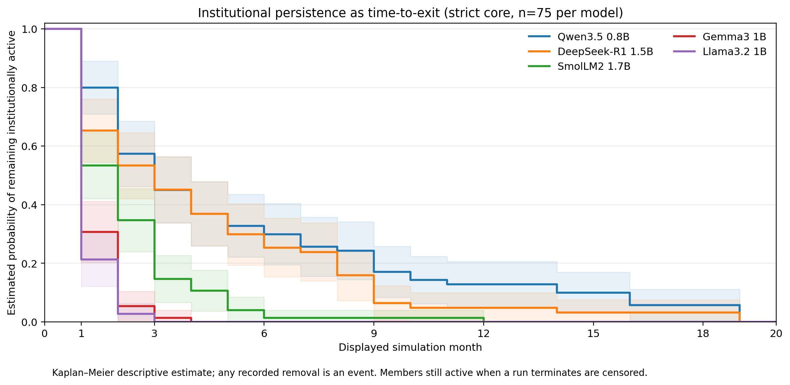
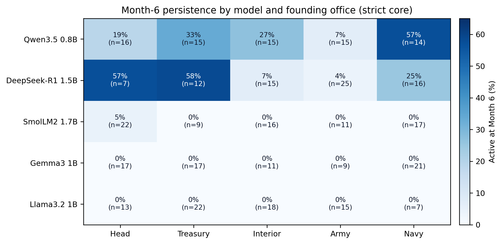
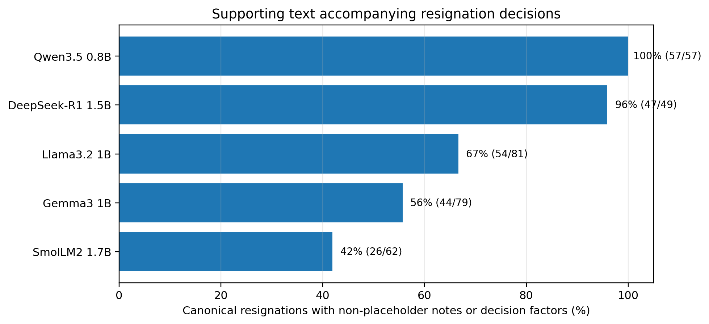
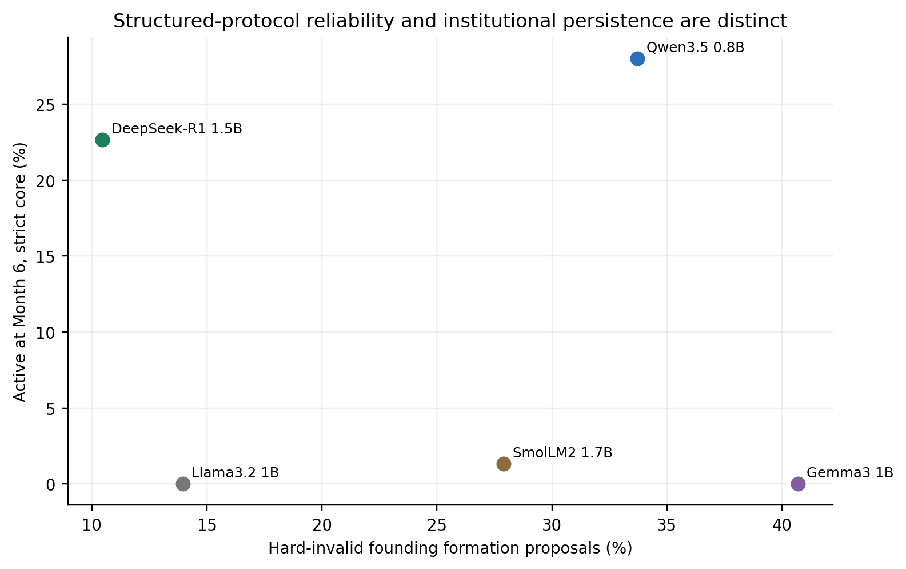

# Karamaniya

**Karamaniya** is a persistent multi-agent AI evaluation environment designed to study **long-horizon behavior under institutional constraints**.

Five language-model agents govern the same evolving fictional country while occupying different offices, receiving asymmetric information, communicating privately, negotiating, voting, issuing structured actions, and facing path-dependent consequences.

The project is intended as **measurement science for persistent multi-agent AI systems**, not as a predictor of real-world politics.

---

## Research motivation

Most LLM evaluations focus on isolated prompts, short tasks, or final outcomes.

Karamaniya instead studies what happens when agents must operate over long trajectories with:

- persistent memory,
- institutional roles,
- asymmetric information,
- public and private communication,
- negotiation and revision,
- structured actions,
- and path-dependent consequences.

The central question is:

> **Which apparent long-horizon behavioral differences are reproducible properties of the models, and which are caused by role assignment, information access, interaction structure, or artifacts of the evaluation harness?**

A secondary question is whether final outcomes such as unanimous votes can hide substantial disagreement earlier in the decision trajectory.

---

## System design

Karamaniya separates **model decisions** from **world consequences**.

### Agent layer

Five LLM agents occupy different institutional roles and can:

- form independent positions,
- send private messages,
- negotiate,
- table motions,
- vote,
- revise positions,
- issue role-specific directives,
- maintain persistent notes and commitments.

### Causal world engine

A separate simulation engine updates the canonical world state after agent decisions.

It tracks variables such as:

- approval,
- inflation,
- food supply,
- unemployment,
- public unrest,
- military readiness,
- diplomatic relations,
- political stability,
- elections,
- and institutional continuity.

This separation is designed to make it possible to distinguish:

```text
model action
        ↓
validated structured action
        ↓
causal world-engine consequence
        ↓
next observation
```

rather than allowing the language model itself to invent the consequences of its actions.

---

## Pilot study

The current public materials describe an initial pilot / instrument-validation study.

### Pilot snapshot

- 85 completed trajectories
- 5 local sub-2B language models
- multiple independent seeds
- multiple framing conditions
- systematic seat rotations
- hundreds of simulated government-months
- full trace logging and integrity checks

The pilot is not treated as confirmatory evidence of fixed model personalities. Its primary purpose was to determine whether Karamaniya can discriminate long-horizon behavior while also exposing weaknesses in the measurement instrument.

The pilot identified candidate differences in institutional persistence, role interaction, structured-action reliability, and decision trajectories — but also surfaced important confounds that must be controlled in future studies.

### Selected results

#### 1. Institutional persistence over time

The pilot produced large differences in how long different local models remained active in the institutional environment. These differences are treated as candidate behavioral signatures, not yet as stable model traits.

The next study will test whether these differences remain after controlling for:

- institutional role,
- action ordering,
- information access,
- engine version,
- and resignation-format artifacts.



#### 2. Model × office interaction

Persistence also appeared to interact with the institutional role occupied by the model. Some model–office combinations survived considerably longer than others, although several cells are small and the effect is currently exploratory.

The prospective study will use systematic seat swaps and preregistered time-to-event analysis to separate:

```text
model effect
+ office effect
+ model × office interaction
```



#### 3. Resignation mechanism audit

One of the most important findings of the pilot was methodological. A detailed audit showed that not every resignation should be interpreted as a meaningful institutional decision. Some exits contained weak, placeholder-like, or low-substance output.

This substantially narrowed the interpretation of the original persistence result. The next version of the experiment will include:

- explicit resignation-reason classification,
- raw-response → parser → canonical-state tracing,
- action-order randomization,
- and checks for menu-position or formatting artifacts.

This is an example of the broader goal of the project:

> The evaluation instrument itself must be validated before behavioral conclusions are trusted.



#### 4. Protocol reliability and persistence are different measurements

The pilot also suggested that structured-action reliability and institutional persistence do not necessarily move together.

A model may remain active for a long trajectory while still producing a relatively high number of invalid or poorly structured actions. This motivates treating these as separate dimensions:

```text
protocol competence ≠ institutional persistence
```



### Important limitations

The pilot exposed several limitations that are documented directly rather than hidden from the analysis. These include:

- placeholder-like resignation events,
- role-dependent removal mechanisms,
- excessive world-state persistence when government offices become vacant,
- structured-action validation failures,
- small sample sizes for some model × office cells,
- and automated trajectory labels that still require human validation.

Two behaviorally corrected trajectories were excluded from clean behavioral analysis. The current results should therefore be interpreted primarily as instrument-validation evidence and hypothesis generation.

---

## Why this is measurement science

Karamaniya is not intended to answer whether one model is a "better ruler."

The scientific goal is to build and validate an instrument for measuring persistent multi-agent AI behavior. The project studies questions such as:

- How stable are model behaviors across long trajectories?
- How much does institutional role change behavior?
- How often do agents revise positions after new information or negotiation?
- Does final consensus conceal earlier disagreement?
- How reliably do agents translate negotiated decisions into valid actions?
- Which observed behaviors are genuine, and which are artifacts of the evaluation environment?

---

## Next research phase

The planned next phase is a prospective frontier-model study using a corrected and frozen engine version.

Planned controls include:

- bridge replays across engine versions,
- same-model governments,
- systematic seat swaps,
- independent world seeds,
- equalized-information conditions,
- memory and negotiation ablations,
- action-order randomization,
- human-validated trajectory labels,
- and preregistered survival / competing-risk analysis.

A small frontier-model calibration batch will first measure actual:

- input-token usage,
- output and reasoning-token usage,
- prompt-cache savings,
- trajectory length,
- and retry rates.

The final experimental grid will then be sized from measured compute requirements rather than estimated blindly.

---

## Research materials

### Papers

- [Preliminary Research Paper v1.5](paper/Karamaniya_Anthropic_AI_for_Science_Preliminary_Paper_v1.5.pdf)
- [Two-page Executive Brief](paper/Karamaniya_Anthropic_AI_for_Science_Executive_Brief_v1.0.pdf)

### Documentation

- [Study design](methodology/study_design.md)
- [Repository notes](docs/repository_notes.md)
- [Causal world model](docs/CAUSAL_WORLD_MODEL.md): every equation, unit, parameter range and lag in the world engine
- [Token efficiency](docs/TOKEN_EFFICIENCY.md): where a run's tokens go, and opt-in ways to send fewer of them
- [Engineering backlog](docs/ENGINEERING_BACKLOG.md)

### Code

The simulator itself is in this repository: the [`karamaniya/`](karamaniya/) package, its tests in
[`tests/`](tests/) and run-analysis scripts in [`tools/`](tools/). [ENGINE.md](ENGINE.md) explains how to
run it, how to choose the five models, and what every run folder records.

```bash
python -m karamaniya gui                      # the control room, in your browser
python -m unittest discover -s tests -t .     # the test suite
```

It needs Python 3.12 or newer and otherwise only the standard library; `pip install -r requirements.txt`
adds the `anthropic` package, which only seats calling the Anthropic API directly use.

To see a whole run without an API key, five rule-following stand-ins can play the council. They read
the world, not the prompt, so they exercise the machinery rather than any model's behaviour, and they
make a crude baseline government:

```bash
python -m karamaniya run council.scripted.toml --months 6 --name first-look
python -m karamaniya tokens runs/first-look    # where its input went, and what a cache could reuse
python -m karamaniya audit runs/first-look     # was every motion executed as the act it described?
```

That takes a few seconds and writes the same kind of run folder a real council does: the call log
(`log.jsonl`), every prompt as sent (`prompts.jsonl`), the manifest and `report.html`.

### Reproducibility checks

The test suite runs on every push, on Python 3.12 and 3.13. Among what it holds the code to:

- **The same seed is the same run.** Two runs from one seed with the scripted seats produce the same
  world month by month, the same council state and the same prompts
  (`tests/test_reproducibility.py`). Real models are not deterministic, and each run's manifest says so;
  this is the engine's half.
- **A default run sends recorded prompts.** It sends byte for byte the prompts recorded for the current
  engine (`tests/test_prompt_freeze.py`), so anything opt-in stays opt-in.
- **Motions do what they said.** `python -m karamaniya audit runs/<name>` checks every executed motion
  against the act its text described.
- **Mixed code is visible.** Every simulated month records a fingerprint of the engine source that
  produced it, and a run resumed under different code is reported as mixed, not as one engine's run.

The code here is engine version 6 (see `karamaniya/versions.py`), released as the tag
[`engine-6`](https://github.com/S2Lobby/karamaniya-research/tree/engine-6). Engine 5, the first public
release, is the tag [`engine-5`](https://github.com/S2Lobby/karamaniya-research/tree/engine-5); engine 6
corrects what its prompts told the delegates, and what changed is in [CHANGELOG.md](CHANGELOG.md). Every
run folder records the engine, prompt and psychology versions that produced it.

### Compute

Long trajectories are expensive, and the planned frontier study starts by measuring what a run costs.
`python -m karamaniya tokens runs/<name>` breaks a run's input and output down by phase, seat and prompt
section, with the counts the providers reported and a deterministic simulation of how much a prompt
cache could reuse. In a 12-month scripted run the system prompt alone is a third of all input. Opt-in
features, all off by default and recorded in each run's manifest when on, cut that: a cache-friendly
prompt layout doubles the share of input a cache can reuse (21% to 41% within a month), and a council
that may skip months when every delegate stands by and nothing new has arrived makes up to 24% fewer
calls (none fewer while a foreign government writes every month). Replayed
through a real local server (Ollama, Llama 3.2 and DeepSeek-R1 distill), the layout cut the prompt
tokens the model had to evaluate by a quarter, matching the simulation within three points. Given a
batch of runs, the ledger turns them into a cost per simulated month, per seat, to size a study from.
Details, measurements and limits are in [docs/TOKEN_EFFICIENCY.md](docs/TOKEN_EFFICIENCY.md). A default
run still sends exactly its recorded prompts; a test holds it to them.

---

## Repository structure

```text
karamaniya-research/
├── README.md
├── ENGINE.md                  how to run the simulator
├── CHANGELOG.md               what changed in each engine release
├── LICENSE                    Apache-2.0, for the code
├── requirements.txt
├── council.*.toml             example council files
│
├── karamaniya/                the simulator
├── tests/
├── tools/                     run-analysis scripts
│
├── paper/
│   ├── Karamaniya_Anthropic_AI_for_Science_Preliminary_Paper_v1.5.pdf
│   └── Karamaniya_Anthropic_AI_for_Science_Executive_Brief_v1.0.pdf
│
├── figures/
│   ├── fig3_km_persistence_v11.png
│   ├── fig4_model_office_heatmap.png
│   ├── fig6_resignation_support_v12.png
│   └── fig6_protocol_vs_persistence.png
│
├── methodology/
│   └── study_design.md
│
└── docs/
    ├── repository_notes.md
    ├── CAUSAL_WORLD_MODEL.md
    ├── TOKEN_EFFICIENCY.md
    └── ENGINEERING_BACKLOG.md
```

---

## Status

- **Research stage:** Pilot / instrument validation
- **Next stage:** Controlled frontier-model study
- **Project status:** Active

---

## License

The source code (`karamaniya/`, `tests/`, `tools/` and the example council files) is released under the
[Apache License 2.0](LICENSE). The paper, the figures and the written research materials are not covered
by that license.

---

## Author

**Muhammadjon Ahmadjonov**  
Independent Researcher  
Uzbekistan

Research interests include persistent AI agents, multi-agent systems, AI evaluation, long-horizon behavior, and evaluation reliability.
